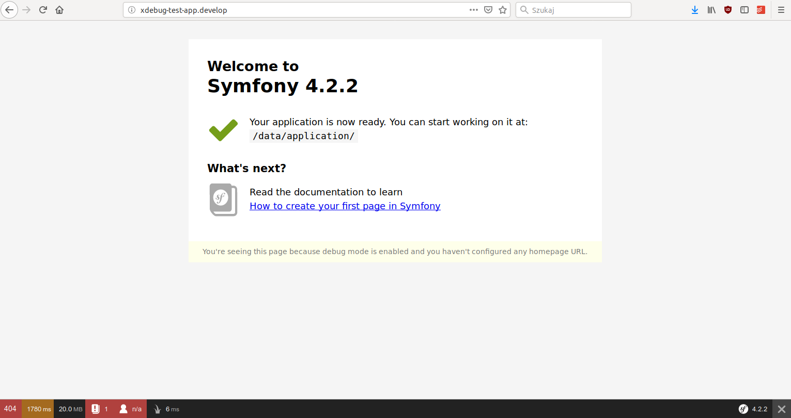
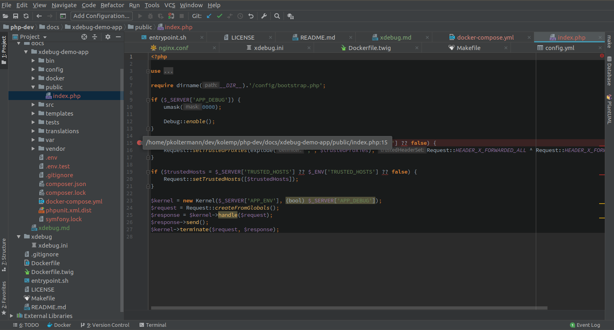
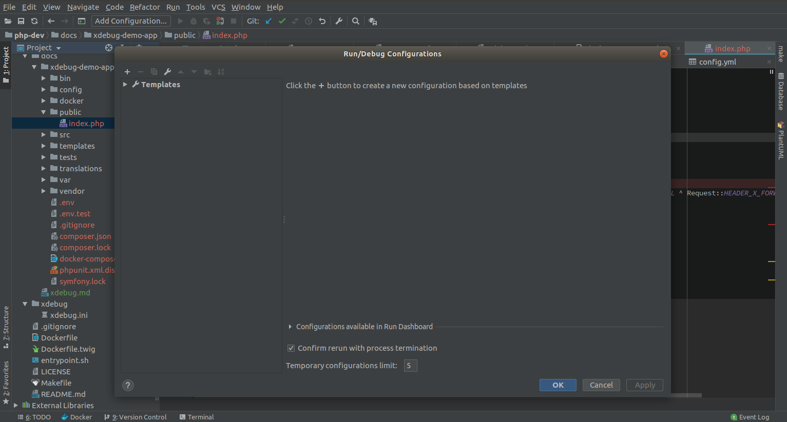
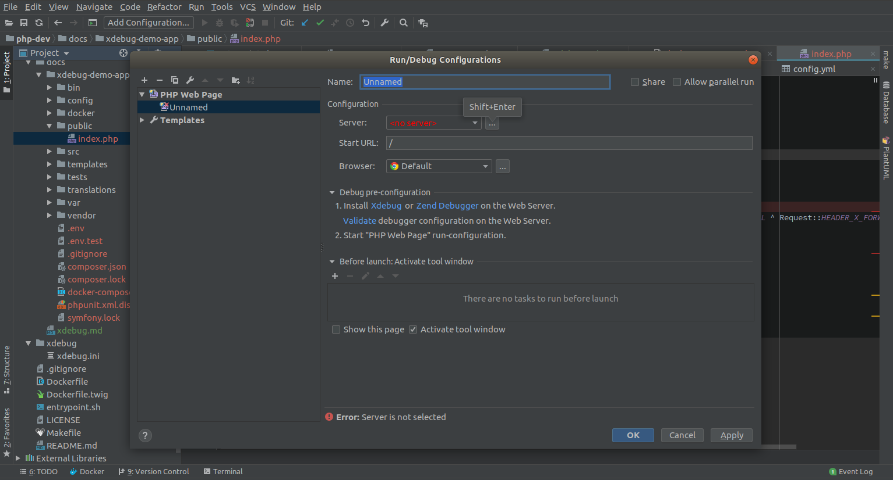
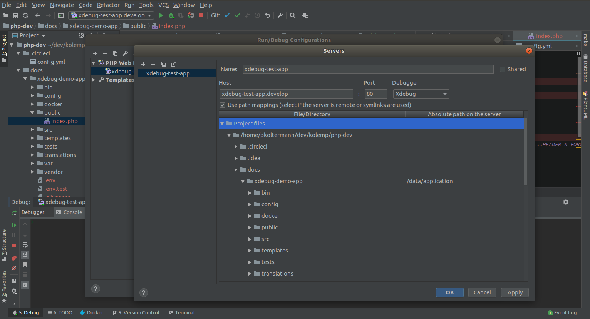
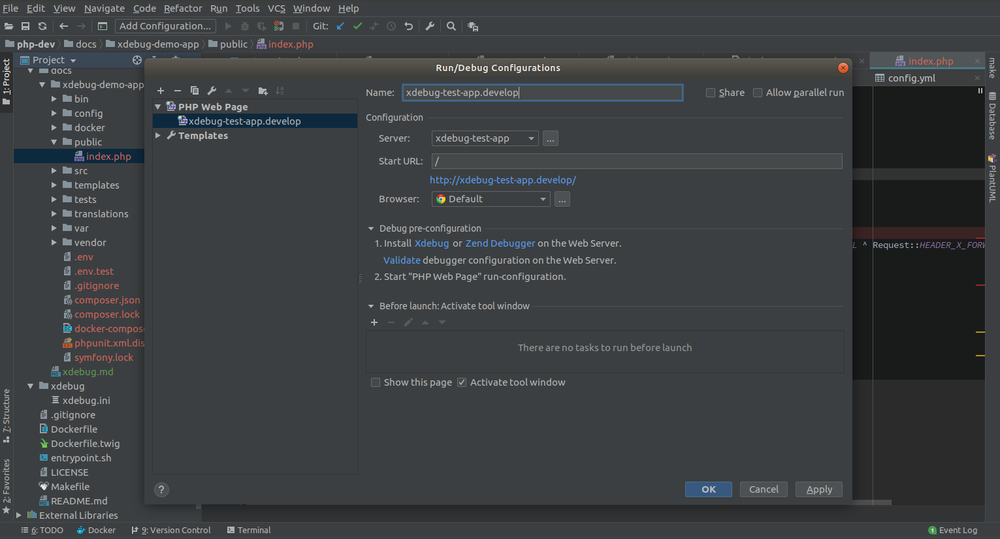
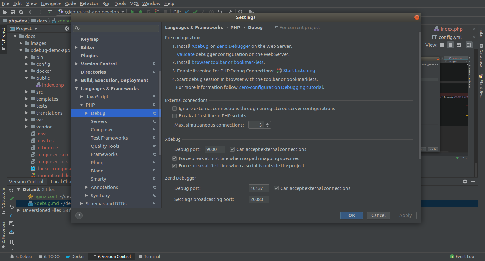
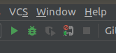
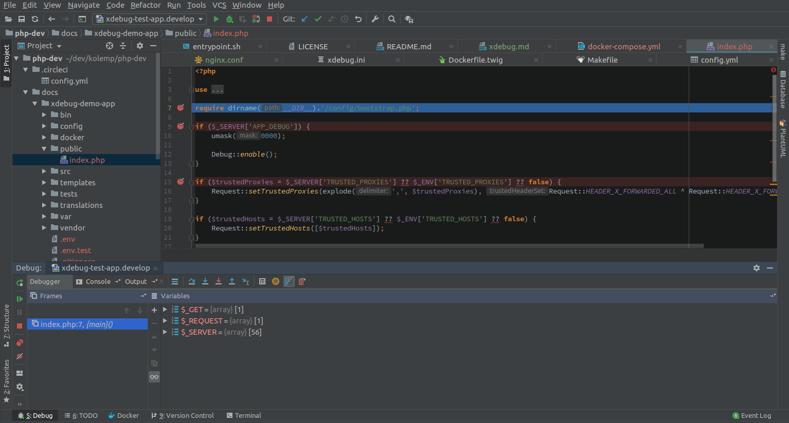

# Xdebug + Docker + PHPStorm - It's easy

This is tutorial showing how easy is to set up xdebug debugging for applications running in docker containers using php-dev image. I'll be showing it on simple Symfony application but you can do it same way for any PHP based application.

## Target application

Let's assume you have a nice Symfony application, you can create one for example this way:

```bash
docker run --rm -v `pwd`:/data/application -e "USER_ID=$UID" kolemp/php-dev:7.2 \
    composer create-project symfony/website-skeleton xdebu-demo-app
```

Now go to project directory. Your docker-compose.yml should look similar to [this](xdebug-demo-app/docker-compose.yml).
Being in the project root directory run

```bash
docker-compose up -d
```

In the given example I'm using [dory](https://github.com/FreedomBen/dory) http proxy (works on linux and OSX). If you dont want or cant use it, just expose port 80 but if you can I would strongly advise to use dory.

At this point the page is up and running:


Next start PHPStorm open dir with app and set up some breakpoint in index file.
This way you will know if debugging works.


## Configuration

Now it's time to configure PHPStorm debugger:

1. Open *Run -> Edit Configurations* from the top menu


2. Add *PHP WEB Page* configuration (plus sign at the top left corner). Click three dots next to *Server* field to add new server configuration.


4. Enter server hostname. If you use proxy, enter the configured name, if not, pass docker host IP (127.0.0.1 if you are not using [Docker Toolbox](https://docs.docker.com/toolbox) / [Dinghy](https://github.com/codekitchen/dinghy-http-proxy)). It is very important to also specify path mappings. Set mapping between your project document root on your dev machine and inside container. By default in container it is `/data/application` for *php-dev* image. Click ok when finished.


5. If you haven't done it yet, please fill name for the configuration.


6. One last thing to check left. Please open PHPStorm preferences and go to *Language & Frameworks -> PHP -> Debug*
and check if port is set to 9000 and enabled.



## Debugging

Now you should be ready, just open *index.php* file and click green bug icon  on the top menu.
Browser should open but halt on loading and PHPStorm should stop on set breakpoint
 

## Demo app

[Here](xdebug-demo-app) you can find working demo application from the examples. You just need to clone it, adjust the hostname in `docker-compose.yml` (or open a port) and run:
```bash
docker-compose up -d
docker-compose exec php composer install
```

## Thanks
**If you use often Xdebug [consider donating](https://xdebug.org/).**